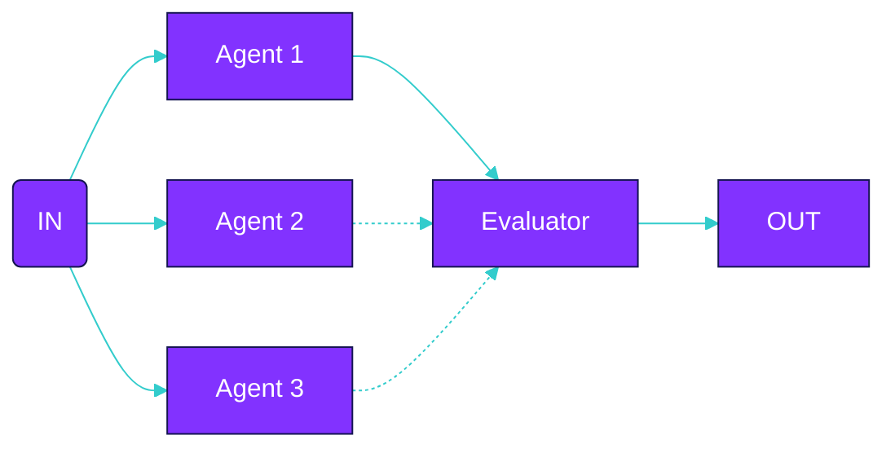

Declare agents
```typescript
const responseAgent =  agent({
  model: openai('gpt-4'),
  system: 'You are consumer relations specialist...',
})
```

Declare flow
```typescript
const bestOfFlow = bestOfAll({
  name: 'generateBestResponse',
  criteria: 'Pick the response that is most helpful and concise'
  input: [
    {
      agent: 'responseAgent',
      input: 'Generate response version 1'
    },
    {
      agent: 'responseAgent',
      input: 'Generate response version 2'
    }
  ],
})
```

Execute
```typescript
execute(bestOfFlow, {
  agents: {
    responseAgent
  }
})
```