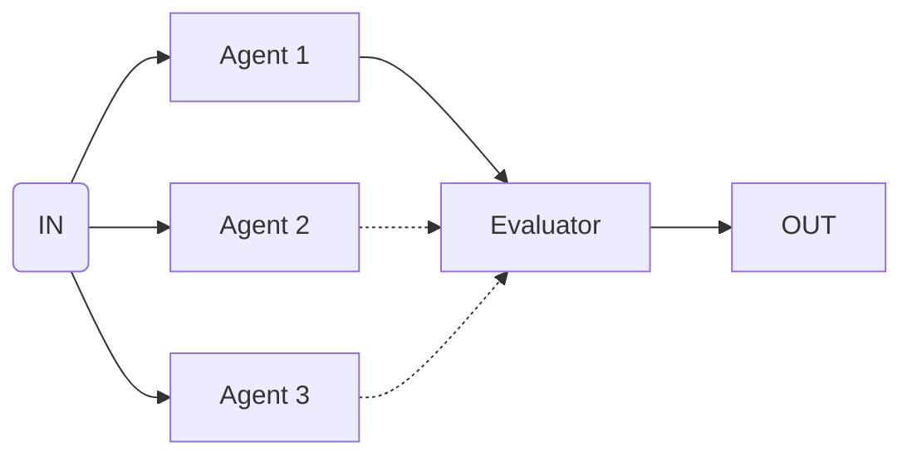

Use this flow to generate multiple alternatives and pick the best one.

<CodeGroup>

```ts flow.ts
const bestOfFlow = bestOfAll({
  criteria: 'Pick the response that is most helpful and concise'
  input: [
    {
      agent: 'responseAgent',
      input: 'Generate response version 1'
    },
    {
      agent: 'responseAgent',
      input: 'Generate response version 2'
    }
  ],
})
```

```ts agents.ts
const responseAgent =  agent({
  model: openai('gpt-4o'),
  system: 'You are consumer relations specialist...',
})
```

```ts main.ts
execute(bestOfFlow, {
  agents: {
    responseAgent
  }
})
```

</CodeGroup>
