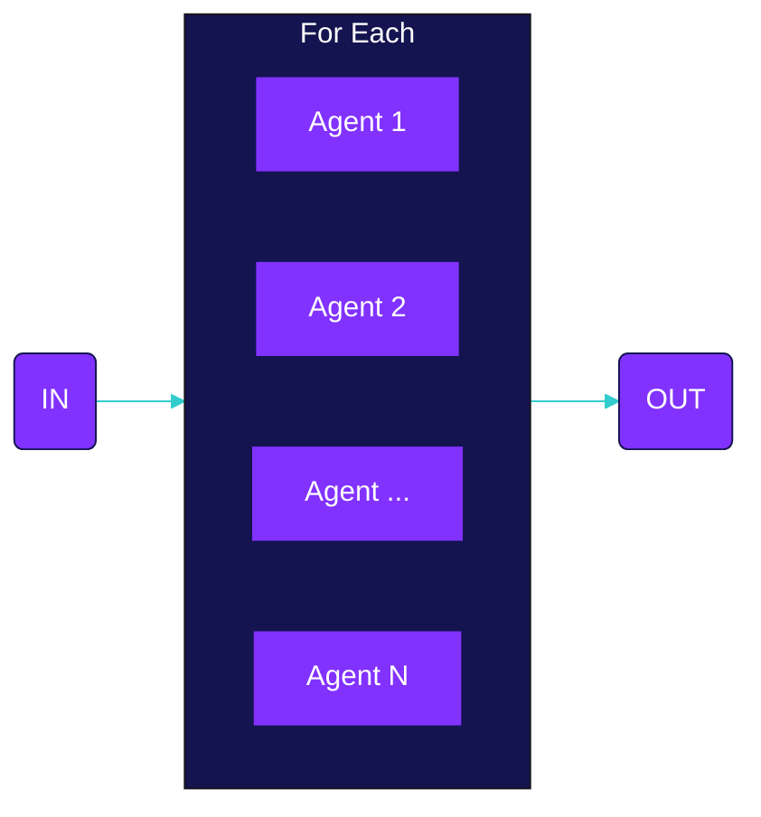

Declare agents
```typescript
const githubAgent = agent({
  model: openai('gpt-4'),
  system: 'You are a github crawler...',
  tools: {
    ...toolsForGithub
  }
})

const responseAgent = agent({
  model: openai('gpt-4'),
  system: 'You are responsible for summarizing issues on github...',
})
```

Declare flow
```typescript
const processGithubIssuesFlow = forEach({
  input: [
    {
      agent: 'githubAgent',
      name: 'getIssues',
      input: 'Go to Github and get the top 3 most popular issues and number of open issues.',
    },
    forEach({
      name: 'iterateOverIssues',
      forEach: 'Github issue and total number of open issues',
      input: {
        agent: 'responseAgent',
        input: 'Send an email to the maintainer.',
      },
    })
  ]
})
```

Execute
```typescript
execute(processGithubIssues, {
  agents: {
    githubAgent,
    responseAgent
  }
})
```