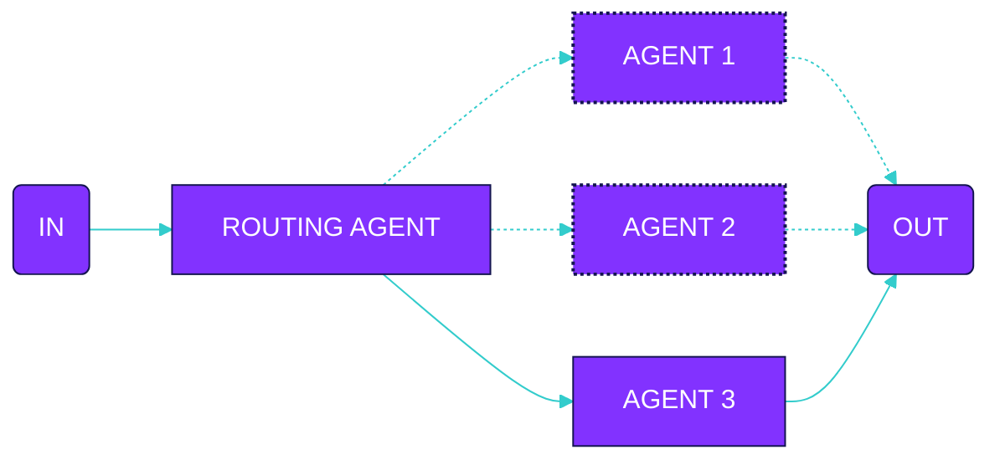

Declare agents

```typescript
const germanAgent = agent({
  model: openai('gpt-4o'),
  system: 'You are a german translation agent...',
})

const polishAgent = agent({
  model: openai('gpt-4o'),
  system: 'You are a polish translation agent...',
})

const spanishAgent = agent({
  model: openai('gpt-4o'),
  system: 'You are a spanish translation agent...',
})
```

Declare flow

```typescript
const oneOfTranslationFlow = oneOf([
  {
    when: 'The article is in German',
    input: {
      agent: 'germanAgent',
      input: 'Translate the article to English'
    }
  },
  {
    when: 'The article is in Polish',
    input: {
      agent: 'polishAgent',
      input: 'Translate the article to English'
    }
  },
  {
    when: 'The article is in Spanish',
    input: {
      agent: 'spanishAgent',
      input: 'Translate the article to English'
    }
  }
])
```

Execute flow

```typescript
execute(oneOfTranslationFlow, {
  agents: {
    germanAgent,
    polishAgent,
    spanishAgent
  },
  input: 'The article content to translate...'
})
```
