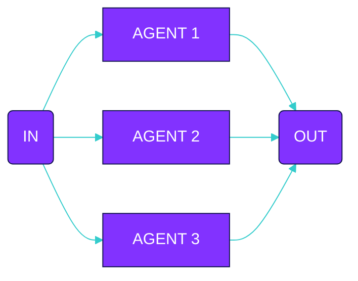

Declare agents
```typescript
const germanAgent = agent({
  model: openai('gpt-4'),
  system: 'You are a german translation agent...',
})

const polishAgent = agent({
  model: openai('gpt-4'),
  system: 'You are a polish translation agent...',
})

const spanishAgent = agent({
  model: openai('gpt-4'),
  system: 'You are a spanish translation agent...',
})
```

Declare flow
```typescript
const parallelTranslationFlow = parallel({
  name: 'translateToMultipleLanguages',
  input: [
    {
      agent: 'germanAgent',
      input: 'The article content to translate...'
    },
    {
      agent: 'polishAgent',
      input: 'The article content to translate...'
    },
    {
      agent: 'spanishAgent',
      input: 'The article content to translate...'
    }
  ]
})
```

Execute
```typescript
execute(parallelAnalysisFlow, {
  agents: {
    sentimentAnalysisAgent,
    topicExtractionAgent,
    keywordExtractionAgent
  }
})
```