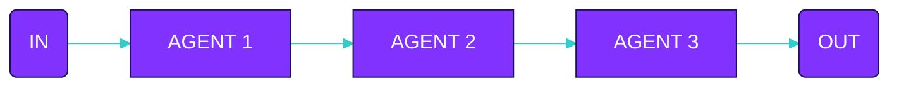

Declare agents

```typescript
const translationAgent = agent({
  model: openai('gpt-4o'),
  system: 'You are a translation agent...',
})

const grammarAgent = agent({
  model: openai('gpt-4o'),
  system: 'You are a grammar agent...',
})

const summaryAgent = agent({
  model: openai('gpt-4o'),
  system: 'You are a summary agent...',
})
```

Declare flow

```typescript
const translateFlow = sequence([
  {
    agent: 'translationAgent',
    input: 'Translate this text to English',
  },
  {
    agent: 'grammarAgent',
    input: 'Check for grammar errors',
  },
  {
    agent: 'summaryAgent',
    input: 'Now summarize the translated text',
  }
])
```

Execute

```typescript
execute(translateFlow, {
  agents: {
    translationAgent,
    grammarAgent,
    summaryAgent
  }
})
```
