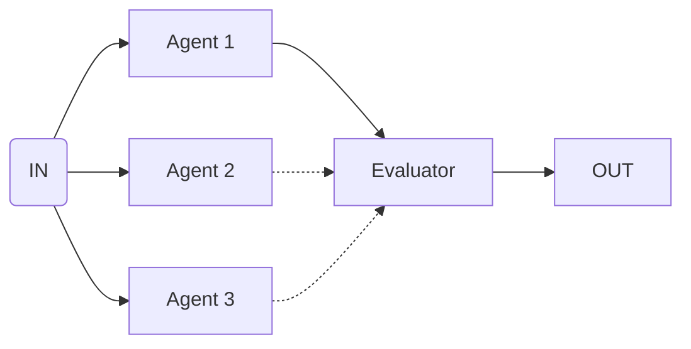

import { Code } from '@astrojs/starlight/components';
import { Tabs, TabItem } from '@astrojs/starlight/components';



Use this flow to generate multiple alternatives and pick the best one.

<Tabs>
  <TabItem label="flow.ts">
    ```ts
    import * as agents from './agents.ts'

    export const bestOfFlow = bestOfAll({
      criteria: 'Pick the response that is most helpful and concise',
      input: [
        {
          agent: 'responseAgent',
          input: 'Generate response version 1'
        },
        {
          agent: 'responseAgent',
          input: 'Generate response version 2'
        }
      ],
    })

    execute(bestOfFlow, {
      agents
    })
    ```
  </TabItem>
  <TabItem label="agents.ts">
    ```ts
    export const responseAgent = agent({
      model: openai('gpt-4o'),
      system: 'You are consumer relations specialist...',
    })
    ```
  </TabItem>
</Tabs>
