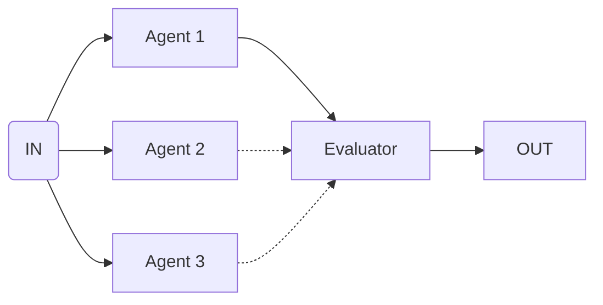

import { Code } from '@astrojs/starlight/components';
import { Tabs, TabItem } from '@astrojs/starlight/components';

Use this flow to generate multiple alternatives and pick the best one.



## API Reference

### `criteria`

**type:** `string`

Criteria to evaluate the responses and pick the best one.

### `input`

**type:** `FlowDefinition[]`

Array of flows to evaluate.

## Example

```ts collapse={17-40}
import { bestOfAll } from 'flows-ai/flows'

const bestOfFlow = bestOfAll({
  criteria: 'Pick the response that is most helpful and concise',
  input: [
    {
      agent: 'responseAgent',
      input: 'Generate response version 1'
    },
    {
      agent: 'responseAgent',
      input: 'Generate response version 2'
    }
  ],
})

import { agent, execute } from 'flows-ai'

const responseAgent = agent({
  model: openai('gpt-4o'),
  system: 'You are consumer relations specialist...',
})

execute(bestOfFlow, {
  agents: {
    responseAgent
  }
})
```
