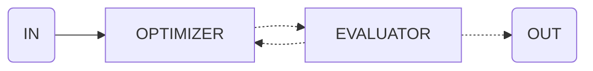

import { Code } from '@astrojs/starlight/components';
import { Tabs, TabItem } from '@astrojs/starlight/components';

Use this flow to iteratively improve results based on specific criteria.



## API Reference

### `input`

**type:** `FlowDefinition`

Flow definition to execute and evaluate.

### `criteria`

**type:** `string`

Criteria to evaluate the response against.

### `max_iterations`

**type:** `number`

Maximum number of iterations to attempt improvement.

## Example

```ts collapse={12-40}
import { evaluator } from 'flows-ai/flows'

const optimizeFlow = evaluator({
  input: {
    agent: 'writingAgent',
    input: 'Write a compelling story'
  },
  criteria: 'The story should be engaging, have a clear plot, and be free of grammar errors',
  max_iterations: 3
})

import { agent, execute } from 'flows-ai'

const writingAgent = agent({
  model: openai('gpt-4o'),
  system: 'You are a writer...',
})

execute(optimizeFlow, {
  agents: {
    writingAgent
  }
})
```
