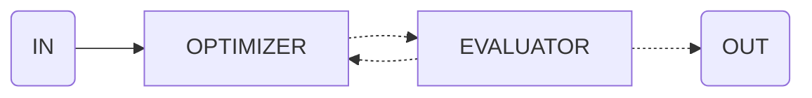

Use this flow to iteratively improve results based on specific criteria.

<CodeGroup>

```ts flow.ts
const optimizeFlow = evaluate({
  input: {
    agent: 'writingAgent',
    input: 'Write a compelling story'
  },
  criteria: 'The story should be engaging, have a clear plot, and be free of grammar errors',
  max_iterations: 3
})
```

```ts agents.ts
const writingAgent =  agent({
  model: openai('gpt-4o'),
  system: 'You are a writer...',
})
```

```ts main.ts
execute(optimizeFlow, {
  agents: {
    writingAgent
  }
})
```

</CodeGroup>
