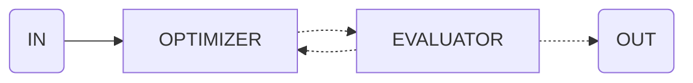

import { Code } from '@astrojs/starlight/components';
import { Tabs, TabItem } from '@astrojs/starlight/components';



Use this flow to iteratively improve results based on specific criteria.

<Tabs>
  <TabItem label="flow.ts">
    ```ts
    import * as agents from './agents.ts'

    export const optimizeFlow = evaluate({
      input: {
        agent: 'writingAgent',
        input: 'Write a compelling story'
      },
      criteria: 'The story should be engaging, have a clear plot, and be free of grammar errors',
      max_iterations: 3
    })

    execute(optimizeFlow, {
      agents
    })
    ```
  </TabItem>
  <TabItem label="agents.ts">
    ```ts
    export const writingAgent = agent({
      model: openai('gpt-4o'),
      system: 'You are a writer...',
    })
    ```
  </TabItem>
</Tabs>
