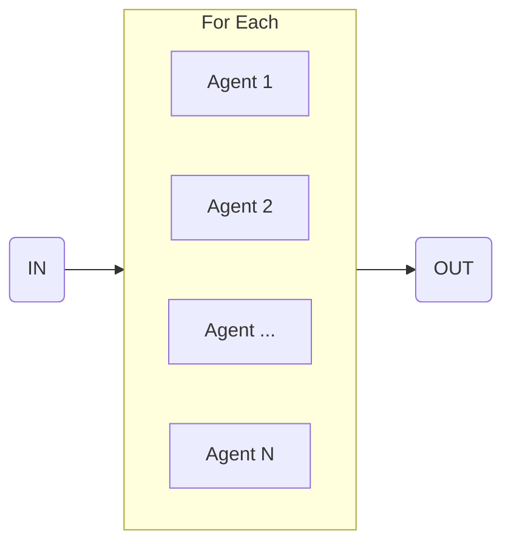

import { Code } from '@astrojs/starlight/components';
import { Tabs, TabItem } from '@astrojs/starlight/components';

Use this flow to process a collection of items.



## API Reference

### `item`

**type:** `ZodTypeAny` | `string`

Zod schema that describes each item in the collection to process. For simple strings, you can also pass a string to describe the item.

### `input`

**type:** `FlowDefinition`

Flow definition to execute for each item.

## Example

```ts collapse={17-40}
import { forEach, sequence } from 'flows-ai/flows'

const processGithubIssuesFlow = sequence([
  {
    agent: 'githubAgent',
    input: 'Go to Github and get the top 3 most popular issues and number of open issues.',
  },
  forEach({
    item: z.object({
      issue: z.string().describe('The single issue title'),
      openIssues: z.number().describe('The number of total open issues'),
    }),
    input: {
      agent: 'responseAgent',
      input: 'Send an email to the project maintainer.',
    },
  })
])

import { agent, execute } from 'flows-ai'

const githubAgent = agent({
  model: openai('gpt-4o'),
  system: 'You are a github crawler...',
})

const responseAgent = agent({
  model: openai('gpt-4o'),
  system: 'You are responsible for summarizing issues on github...',
})

execute(processGithubIssuesFlow, {
  agents: {
    githubAgent,
    responseAgent
  }
})
```
