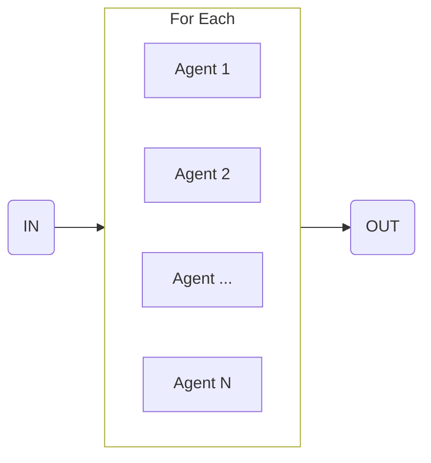

Use this flow to process a collection of items.

<CodeGroup>

```ts flow.ts
const processGithubIssuesFlow = sequence([
  {
    agent: 'githubAgent',
    input: 'Go to Github and get the top 3 most popular issues and number of open issues.',
  },
  forEach({
    item: 'Github issue and total number of open issues',
    input: {
      agent: 'responseAgent',
      input: 'Send an email to the project maintainer.',
    },
  })
])
```

```ts agents.ts
const githubAgent = agent({
  model: openai('gpt-4o'),
  system: 'You are a github crawler...',
})

const responseAgent = agent({
  model: openai('gpt-4o'),
  system: 'You are responsible for summarizing issues on github...',
})
```

```ts main.ts
execute(processGithubIssues, {
  agents: {
    githubAgent,
    responseAgent
  }
})
```

</CodeGroup>
