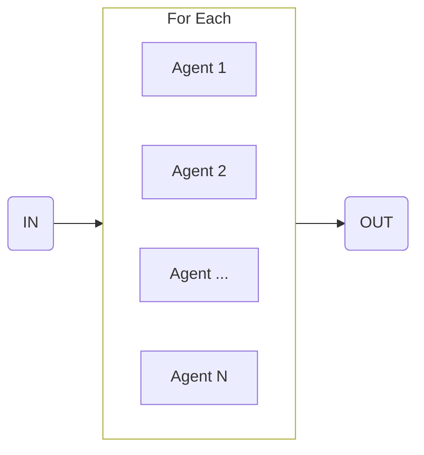

import { Code } from '@astrojs/starlight/components';
import { Tabs, TabItem } from '@astrojs/starlight/components';



Use this flow to process a collection of items.

<Tabs>
  <TabItem label="flow.ts">
    ```ts
    import * as agents from './agents.ts'

    export const processGithubIssuesFlow = sequence([
      {
        agent: 'githubAgent',
        input: 'Go to Github and get the top 3 most popular issues and number of open issues.',
      },
      forEach({
        item: 'Github issue and total number of open issues',
        input: {
          agent: 'responseAgent',
          input: 'Send an email to the project maintainer.',
        },
      })
    ])

    execute(processGithubIssuesFlow, {
      agents
    })
    ```
  </TabItem>
  <TabItem label="agents.ts">
    ```ts
    export const githubAgent = agent({
      model: openai('gpt-4o'),
      system: 'You are a github crawler...',
    })

    export const responseAgent = agent({
      model: openai('gpt-4o'),
      system: 'You are responsible for summarizing issues on github...',
    })
    ```
  </TabItem>
</Tabs>
