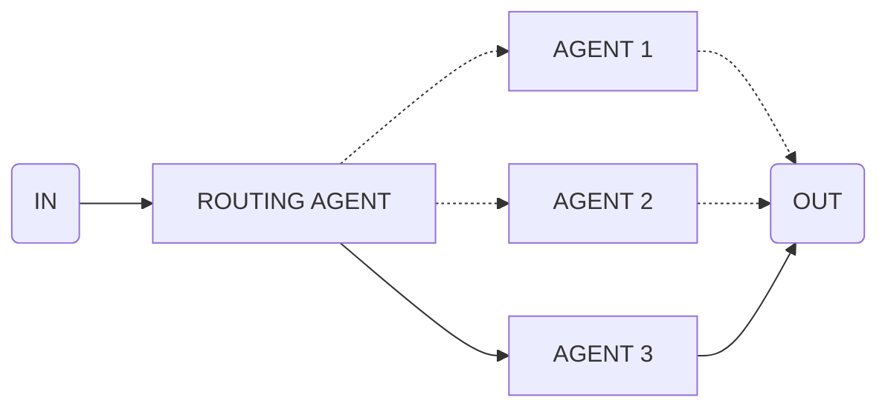

import { Code } from '@astrojs/starlight/components';
import { Tabs, TabItem } from '@astrojs/starlight/components';

Use this flow to dynamically route to different execution paths based on conditions.



## API Reference

### `input`

**type:** `{ when: string; input: FlowDefinition }[]`

Array of condition-flow pairs. The condition is evaluated to determine which flow to execute.

## Example

```ts collapse={27-52}
import { oneOf } from 'flows-ai/flows'

const oneOfTranslationFlow = oneOf([
  {
    when: 'The article is in German',
    input: {
      agent: 'germanAgent',
      input: 'Translate the article to English'
    }
  },
  {
    when: 'The article is in Polish',
    input: {
      agent: 'polishAgent',
      input: 'Translate the article to English'
    }
  },
  {
    when: 'The article is in Spanish',
    input: {
      agent: 'spanishAgent',
      input: 'Translate the article to English'
    }
  }
])

import { agent, execute } from 'flows-ai'

const germanAgent = agent({
  model: openai('gpt-4o'),
  system: 'You are a german translation agent...',
})

const polishAgent = agent({
  model: openai('gpt-4o'),
  system: 'You are a polish translation agent...',
})

const spanishAgent = agent({
  model: openai('gpt-4o'),
  system: 'You are a spanish translation agent...',
})

execute(oneOfTranslationFlow, {
  agents: {
    germanAgent,
    polishAgent,
    spanishAgent
  },
  input: 'The article content to translate...'
})
```
