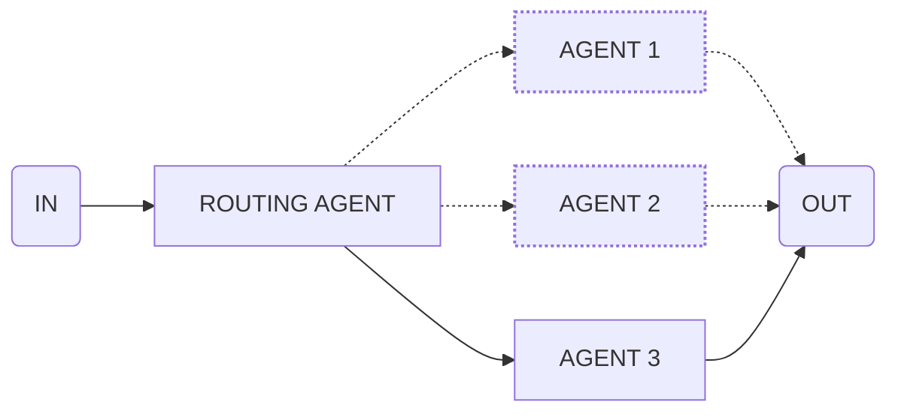

import { Code } from '@astrojs/starlight/components';
import { Tabs, TabItem } from '@astrojs/starlight/components';



Use this flow to dynamically route to different execution paths based on conditions.

<Tabs>
  <TabItem label="flow.ts">
    ```ts
    import * as agents from './agents.ts'

    export const oneOfTranslationFlow = oneOf([
      {
        when: 'The article is in German',
        input: {
          agent: 'germanAgent',
          input: 'Translate the article to English'
        }
      },
      {
        when: 'The article is in Polish',
        input: {
          agent: 'polishAgent',
          input: 'Translate the article to English'
        }
      },
      {
        when: 'The article is in Spanish',
        input: {
          agent: 'spanishAgent',
          input: 'Translate the article to English'
        }
      }
    ])

    execute(oneOfTranslationFlow, {
      agents,
      input: 'The article content to translate...'
    })
    ```
  </TabItem>
  <TabItem label="agents.ts">
    ```ts
    export const germanAgent = agent({
      model: openai('gpt-4o'),
      system: 'You are a german translation agent...',
    })

    export const polishAgent = agent({
      model: openai('gpt-4o'),
      system: 'You are a polish translation agent...',
    })

    export const spanishAgent = agent({
      model: openai('gpt-4o'),
      system: 'You are a spanish translation agent...',
    })
    ```
  </TabItem>
</Tabs>
