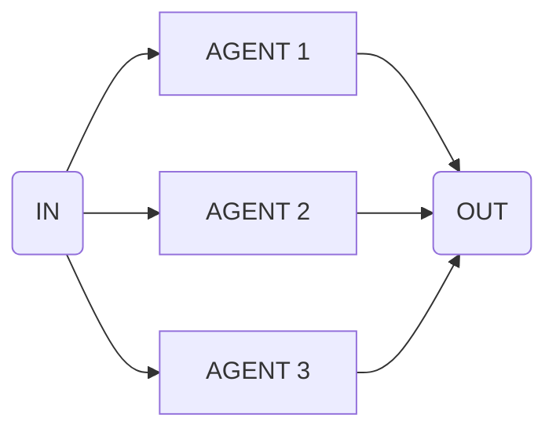

import { Code } from '@astrojs/starlight/components';
import { Tabs, TabItem } from '@astrojs/starlight/components';

Use this flow to run multiple steps concurrently and aggregate results.



## API Reference

### `input`

**type:** `FlowDefinition[]`

Array of flows to execute in parallel.

## Example

```ts collapse={18-52}
import { parallel } from 'flows-ai/flows'

const parallelTranslationFlow = parallel([
  {
    agent: 'germanAgent',
    input: 'Translate the article to German'
  },
  {
    agent: 'polishAgent',
    input: 'Translate the article to Polish'
  },
  {
    agent: 'spanishAgent',
    input: 'Translate the article to Spanish'
  }
])

import { agent, execute } from 'flows-ai'

const germanAgent = agent({
  model: openai('gpt-4o'),
  system: 'You are a german translation agent...',
})

const polishAgent = agent({
  model: openai('gpt-4o'),
  system: 'You are a polish translation agent...',
})

const spanishAgent = agent({
  model: openai('gpt-4o'),
  system: 'You are a spanish translation agent...',
})

execute(parallelTranslationFlow, {
  agents: {
    germanAgent,
    polishAgent,
    spanishAgent
  }
})
```
