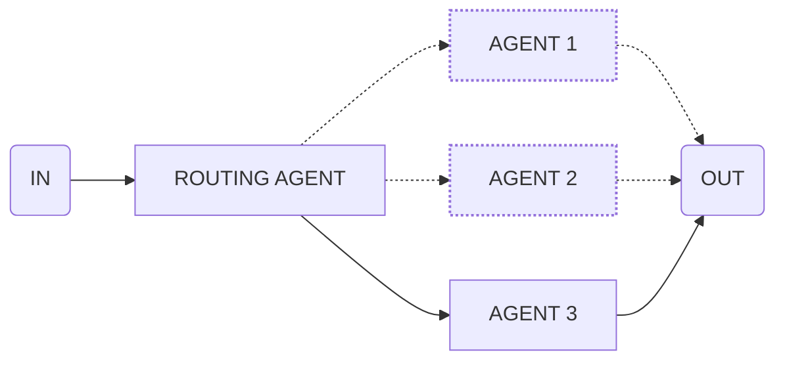

Use this flow to run multiple steps concurrently and aggregate results.

<CodeGroup>

```ts flow.ts
const parallelTranslationFlow = parallel([
  {
    agent: 'germanAgent',
    input: 'Translate the article to German'
  },
  {
    agent: 'polishAgent',
    input: 'Translate the article to Polish'
  },
  {
    agent: 'spanishAgent',
    input: 'Translate the article to Spanish'
  }
])
```

```ts agents.ts
const germanAgent = agent({
  model: openai('gpt-4o'),
  system: 'You are a german translation agent...',
})

const polishAgent = agent({
  model: openai('gpt-4o'),
  system: 'You are a polish translation agent...',
})

const spanishAgent = agent({
  model: openai('gpt-4o'),
  system: 'You are a spanish translation agent...',
})
```

```ts main.ts
execute(parallelTranslationFlow, {
  agents: {
    germanAgent,
    polishAgent,
    spanishAgent
  },
  input: 'The article content to translate...'
})
```

</CodeGroup>
