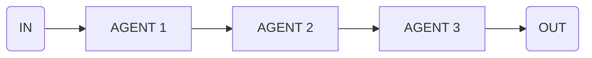

import { Code } from '@astrojs/starlight/components';
import { Tabs, TabItem } from '@astrojs/starlight/components';



Use this flow to chain multiple steps where output of one step becomes input for the next.

<Tabs>
  <TabItem label="flow.ts">
    ```ts
    import * as agents from './agents.ts'

    export const translateFlow = sequence([
      {
        agent: 'translationAgent',
        input: 'Translate this text to English',
      },
      {
        agent: 'grammarAgent',
        input: 'Check for grammar errors',
      },
      {
        agent: 'summaryAgent',
        input: 'Now summarize the translated text',
      }
    ])

    execute(translateFlow, {
      agents
    })
    ```
  </TabItem>
  <TabItem label="agents.ts">
    ```ts
    export const translationAgent = agent({
      model: openai('gpt-4o'),
      system: 'You are a translation agent...',
    })

    export const grammarAgent = agent({
      model: openai('gpt-4o'),
      system: 'You are a grammar agent...',
    })

    export const summaryAgent = agent({
      model: openai('gpt-4o'),
      system: 'You are a summary agent...',
    })
    ```
  </TabItem>
</Tabs>

