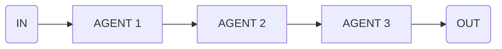

Use this flow to chain multiple steps where output of one step becomes input for the next.

<CodeGroup>

```ts flow.ts
const translateFlow = sequence([
  {
    agent: 'translationAgent',
    input: 'Translate this text to English',
  },
  {
    agent: 'grammarAgent',
    input: 'Check for grammar errors',
  },
  {
    agent: 'summaryAgent',
    input: 'Now summarize the translated text',
  }
])
```

```ts agents.ts
const translationAgent = agent({
  model: openai('gpt-4o'),
  system: 'You are a translation agent...',
})

const grammarAgent = agent({
  model: openai('gpt-4o'),
  system: 'You are a grammar agent...',
})

const summaryAgent = agent({
  model: openai('gpt-4o'),
  system: 'You are a summary agent...',
})
```

```ts main.ts
execute(translateFlow, {
  agents: {
    translationAgent,
    grammarAgent,
    summaryAgent
  }
})
```

</CodeGroup>

