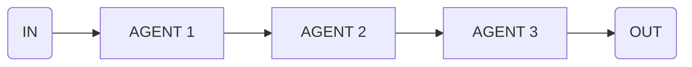

import { Code } from '@astrojs/starlight/components';
import { Tabs, TabItem } from '@astrojs/starlight/components';

Use this flow to chain multiple steps where output of one step becomes input for the next.



## API Reference

### `input`

**type:** `FlowDefinition[]`

Array of flows to execute in sequence.

## Example

```ts collapse={18-52}
import { sequence } from 'flows-ai/flows'

const translateFlow = sequence([
  {
    agent: 'translationAgent',
    input: 'Translate this text to English',
  },
  {
    agent: 'grammarAgent',
    input: 'Check for grammar errors',
  },
  {
    agent: 'summaryAgent',
    input: 'Now summarize the translated text',
  }
])

import { agent, execute } from 'flows-ai'

const translationAgent = agent({
  model: openai('gpt-4o'),
  system: 'You are a translation agent...',
})

const grammarAgent = agent({
  model: openai('gpt-4o'),
  system: 'You are a grammar agent...',
})

const summaryAgent = agent({
  model: openai('gpt-4o'),
  system: 'You are a summary agent...',
})

execute(translateFlow, {
  agents: {
    translationAgent,
    grammarAgent,
    summaryAgent
  }
})
```
